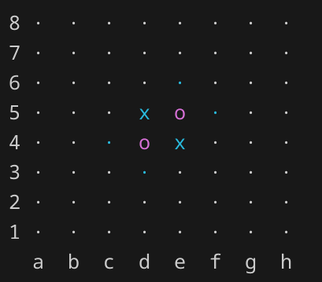
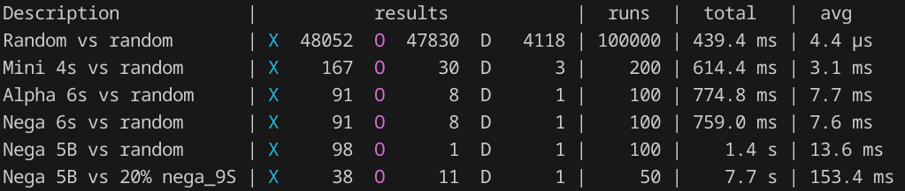

# Othello
This is my first project in rust. The goal was to rewrite and improve my first programming project written in Python.
This implementation efficiently stores the board using 2 - 64 bit unsigned integers and is ~1000 times faster.

# Build
There are two build targets for this project - othello and test.

    cargo run --release             // runs the playable game
    cargo run --release --bin test  // runs speed/winrate benchmarks

# How to play
Here are the official rules for the game https://www.worldothello.org/about/about-othello/othello-rules/official-rules/english.

The moves in the game should be formatted like {FileRank}, for example a3. All possible moves are marked by a dot that's the same colour as your pieces.

# Benchmarks
Example benchmark output.

